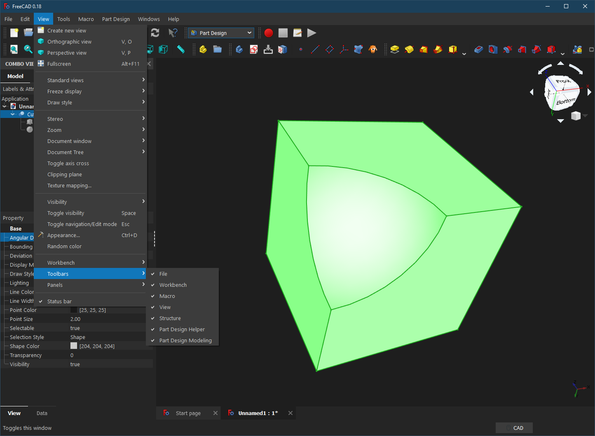
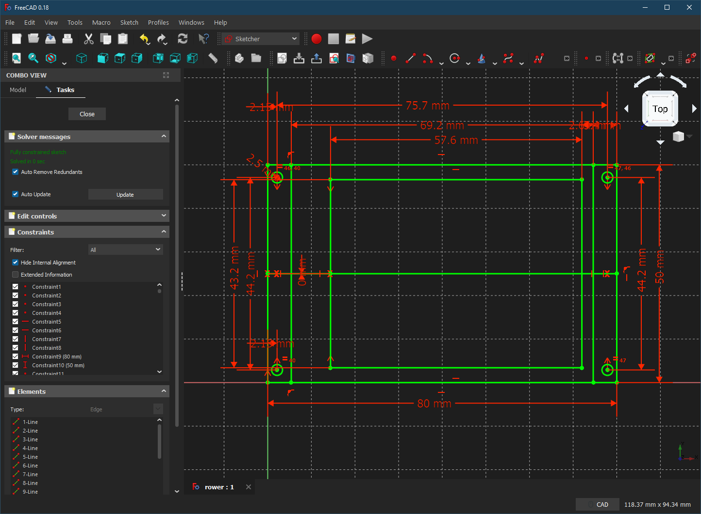

# Charcoal-blue dark theme for FreeCAD
A vscode-inspired dark theme for FreeCAD.  Based on the Dark Blue theme by
Pablo Gil Fernández (https://github.com/pgilfernandez/FreeCAD_stylesheets).

Was tested with FreeCAD 0.18.

Seems to mostly work fine with the 0.19 pre-release, with minor visual issues in menus.

## Install
1. Place the downloaded .qss file in the path that fits your OS:
    - OSX = /Users/[YOUR_USER_NAME]/Library/Preferences/FreeCAD/Gui/Stylesheets/
    - WINDOWS = C:/[INSTALLATION_PATH]/FreeCAD/data/Gui/Stylesheets/
    - LINUX = /home/[YOUR_USER_NAME]/.FreeCAD/Gui/Stylesheets/

2. Some colors are controlled by user settings and not by the theme. Set these
   from the Preferences dialog:

    - Change Edit/Preferences/Display/Colors/Background Color to Simple Color: #1e1e1e
    - Change Edit/Preferences/Display/Colors/Object being edited to #0e639c
    - Change Edit/Preferences/Display/Colors/Active Container to #3c3c3c
    - Change Edit/Preferences/Display/Part Colors/Default line color to #5c5c5c
    - Change Edit/Preferences/Display/Part Colors/Default vertex color to #5c5c5c
    - Change Edit/Preferences/Start/Background Color to #1e1e1e
    - Change Edit/Preferences/Start/Page Background Color to #555555
    - Change Edit/Preferences/Start/Box Background Color to #777777
    - Change Edit/Preferences/Start/Link Color to #084066

3. Optionally, change the colors used in sketches and in the 3D scene to
   match the theme colors:

   - Change Edit/Preferences/Display/Colors/Enable preselection highlighting to #1177bb
   - Change Edit/Preferences/Display/Colors/Enable selection highlighting to #1177bb
   - Change Edit/Preferences/Sketcher/Colors/Construction geometry to #446688
   - Change Edit/Preferences/Sketcher/Colors/Fully constrained geometry to #44cc44
   - Change Edit/Preferences/Sketcher/Colors/Constraint color to #cc4444
   - Change Edit/Preferences/Sketcher/Colors/Reference constraint color to #0044cc